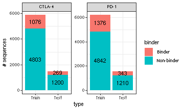
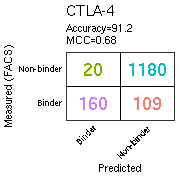
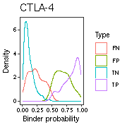
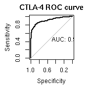
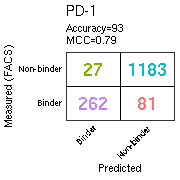
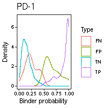
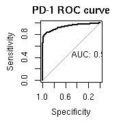

# Predicting antibody binders and generating synthetic antibodies using deep learning

Author: Yoong Wearn Lim

Date: 2022/02/18

## Goals

1. To predict binder and non-binder antibodies to CTLA-4 and PD-1, using Convolutional Neural Network (CNN).
2. To generate synthetic antibody sequences (CDR3K + CDR3H) to CTLA-4 and PD-1, using Generative Adversarial Network (GAN).

## Settings

Ensure that python3 and tensorflow version 2.4.0 are used.


```r
knitr::opts_chunk$set(warning=FALSE, message=FALSE)

library(reticulate)
use_virtualenv("py3-virtualenv")
py_config()
```

```
## python:         /home/ywlim/.virtualenvs/py3-virtualenv/bin/python
## libpython:      /usr/lib/python3.6/config-3.6m-x86_64-linux-gnu/libpython3.6.so
## pythonhome:     /home/ywlim/.virtualenvs/py3-virtualenv:/home/ywlim/.virtualenvs/py3-virtualenv
## virtualenv:     /home/ywlim/.virtualenvs/py3-virtualenv/bin/activate_this.py
## version:        3.6.9 (default, Jul 17 2020, 12:50:27)  [GCC 8.4.0]
## numpy:          /home/ywlim/.virtualenvs/py3-virtualenv/lib/python3.6/site-packages/numpy
## numpy_version:  1.19.2
## 
## python versions found: 
##  /home/ywlim/.virtualenvs/py3-virtualenv/bin/python
##  /home/ywlim/.virtualenvs/r-reticulate/bin/python
##  /home/ywlim/miniconda3/envs/r-reticulate/bin/python
##  /home/ywlim/miniconda3/bin/python3
##  /usr/bin/python3
##  /usr/bin/python
##  /home/ywlim/miniconda3/envs/ame/bin/python
##  /home/ywlim/miniconda3/envs/ice_env/bin/python
##  /home/ywlim/miniconda3/bin/python
```

```r
library(keras)
library(tidyverse)
library(PepTools) 
library(mltools)
library(caret)
library(pROC)

filter = dplyr::filter
select = dplyr::select
theme_set(theme_bw())
```

## Predicting binders vs. non-binders (CNN)

### Prepare sequences 

Here we prepare CDR3K + CDR3H amino acid sequences for both targets:

1. Load all pre- and post-FACS sorted sequences.
2. Randomize the order of the sequences.
3. Pad CDR3K and CDR3H with "-" so all sequences have the same length.
4. Define binders and non-binders.
  * Binders: post/pre fold change >= 1.8, post-sort frequency >= 0.01
  * Non-binders: post/pre fold change < 1, pre-sort frequency >= 0.01
5. Split sequences into training and testing sets.


```r
all <- read_delim("CNN/all_ab_pre_post.txt", delim = "\t")

# shuffle order of data frame
set.seed(42)
rows <- sample(nrow(all))
all <- all[rows, ]

# padding
max_k <- max(nchar(all$CDR3K)) # 11
max_h <- max(nchar(all$CDR3H)) # 25

all$paddedh <- gsub("\\s", "-", format(all$CDR3H, width = max_h))
all$paddedk <- gsub("\\s", "-", format(all$CDR3K, width = max_k))
all$lengthh <- nchar(all$CDR3H)
all$lengthk <- nchar(all$CDR3K)
all$padded <- paste0(all$paddedk, all$paddedh)

# filter for only unique sequences
all2 <- all %>% 
  group_by(padded) %>% 
  top_n(1, wt = post) 
all2 <- all2[!duplicated(all2$padded), ] 

# define binders/non-binders
all2 <- all2 %>% 
  ungroup() %>% 
  mutate(enriched = ifelse((fc >= 1.8 & post >= 0.01), 1,
                           ifelse(fc < 1 & pre >= 0.01, 0, "ambi")))

all2 <- filter(all2, enriched != "ambi")

# split test train
split_train_test <- function(antigenx) {
  mini <- all2 %>% filter(antigen == antigenx)
  set.seed(22)
  trainIndex <- createDataPartition(mini$enriched, p = .8, 
                                  list = FALSE, 
                                  times = 1)
  df_train <- mini[ trainIndex, ]
  df_test  <- mini[-trainIndex, ]

  my_list <- list(train = df_train, test = df_test)
  return(my_list)
}
c1 <- split_train_test("CTLA-4")
p1 <- split_train_test("PD-1")

saveRDS(c1, file = "CNN/c1.RDS")
saveRDS(p1, file = "CNN/p1.RDS")
```

### Visualize test train split


```r
c1$train$type <- "Train"
c1$test$type <- "Test"
c1_both <- bind_rows(c1$train, c1$test)

p1$train$type <- "Train"
p1$test$type <- "Test"
p1_both <- bind_rows(p1$train, p1$test)

both <- bind_rows(c1_both, p1_both)
count <- data.frame(table(both$antigen, both$type, both$enriched))
names(count) <- c("antigen", "type", "binder", "freq")
count$type <- factor(count$type, levels = c("Train", "Test"))

count$binder <- as.numeric(as.character(count$binder))
count$binder[count$binder == 0] <- "Non-binder"
count$binder[count$binder == 1] <- "Binder"

ggplot(count, aes(x = type, y = freq, fill = binder, label = freq)) +
  facet_wrap(~ antigen, scales = "free_y") +
  geom_col(position = "stack") +
  geom_text(position = position_stack(vjust = .5)) +
  theme_bw() +
  labs(y = "# sequences")
```



### Encoding

Encode sequences into numerical matrices (images) using BLOSUM62 scores.


```r
# function to encode peptides
load(file = "BLOSUM62_with_deletion.Rdata")

pep_encode_blosum <- function(pep) {
  bl62_prob <- BLOSUM62
  p_mat <- pep %>% pep_mat
  n_peps <- length(pep)
  l_peps <- nchar(pep[1])
  l_enc <- ncol(bl62_prob)
  o_tensor <- array(data = NA, dim = c(n_peps, l_peps, l_enc))
  for (i in 1:n_peps) {
      pep_i_residues <- p_mat[i, ]
      pep_img <- bl62_prob[pep_i_residues, ]
      o_tensor[i, , ] <- pep_img
  }
  return(o_tensor)
}
```


```r
# CTLA-4
c1_train <- pep_encode_blosum(c1$train$padded)
c1_test  <- pep_encode_blosum(c1$test$padded)

# reshape
c1_train <- array_reshape(c1_train, c(nrow(c1_train), ncol(c1_train), 22, 1))
c1_test  <- array_reshape(c1_test,  c(nrow(c1_test),  ncol(c1_test),  22, 1))

num_classes <- 2

c1_train_y <- c1$train %>% pull(enriched) %>% array %>% keras::to_categorical(num_classes = num_classes)
c1_test_y  <- c1$test  %>% pull(enriched) %>% array %>% keras::to_categorical(num_classes = num_classes)

# PD-1
p1_train <- pep_encode_blosum(p1$train$padded)
p1_test  <- pep_encode_blosum(p1$test$padded)

# reshape
p1_train <- array_reshape(p1_train, c(nrow(p1_train), ncol(p1_train), 22, 1))
p1_test  <- array_reshape(p1_test,  c(nrow(p1_test),  ncol(p1_test),  22, 1))

num_classes <- 2

p1_train_y <- p1$train %>% pull(enriched) %>% array %>% keras::to_categorical(num_classes = num_classes)
p1_test_y  <- p1$test  %>% pull(enriched) %>% array %>% keras::to_categorical(num_classes = num_classes)
 
saveRDS(p1_train,   file = "CNN/p1_train.RDS")
saveRDS(p1_test,    file = "CNN/p1_test.RDS")
saveRDS(p1_train_y, file = "CNN/p1_train_y.RDS")
saveRDS(p1_test_y,  file = "CNN/p1_test_y.RDS")
saveRDS(c1_train,   file = "CNN/c1_train.RDS")
saveRDS(c1_test,    file = "CNN/c1_test.RDS")
saveRDS(c1_train_y, file = "CNN/c1_train_y.RDS")
saveRDS(c1_test_y,  file = "CNN/c1_test_y.RDS")
```

### CNN models 

Here we build CNN models to predict binders vs. non-binders. We train the CTLA-4 model and PD-1 model separately.


```r
model <- keras_model_sequential() %>% 
  layer_conv_2d(filters = 64, kernel_size = c(3, 3), 
                activation = "relu", input_shape = c(36, 22, 1), padding = "same") %>% 
  layer_dropout(rate = 0.5) %>% 
  layer_max_pooling_2d(pool_size = c(2, 2), padding = "same") %>% 
  layer_conv_2d(filters = 32, kernel_size = c(3, 4), 
                activation = "relu", padding = "same") %>% 
  layer_dropout(rate = 0.4) %>% 
  layer_max_pooling_2d(pool_size = c(2, 2), padding = "same") %>% 
  layer_conv_2d(filters = 32, kernel_size = c(4, 4), 
                activation = "relu", padding = "same") %>% 
  layer_dropout(rate = 0.3) %>% 
  layer_flatten() %>% 
  layer_dense(units = 64, activation = "relu") %>% 
  layer_dropout(rate = 0.4) %>% 
  layer_dense(units = 2, activation = "softmax") 
summary(model)
```

```
## Model: "sequential"
## ________________________________________________________________________________
## Layer (type)                        Output Shape                    Param #     
## ================================================================================
## conv2d_2 (Conv2D)                   (None, 36, 22, 64)              640         
## ________________________________________________________________________________
## dropout_3 (Dropout)                 (None, 36, 22, 64)              0           
## ________________________________________________________________________________
## max_pooling2d_1 (MaxPooling2D)      (None, 18, 11, 64)              0           
## ________________________________________________________________________________
## conv2d_1 (Conv2D)                   (None, 18, 11, 32)              24608       
## ________________________________________________________________________________
## dropout_2 (Dropout)                 (None, 18, 11, 32)              0           
## ________________________________________________________________________________
## max_pooling2d (MaxPooling2D)        (None, 9, 6, 32)                0           
## ________________________________________________________________________________
## conv2d (Conv2D)                     (None, 9, 6, 32)                16416       
## ________________________________________________________________________________
## dropout_1 (Dropout)                 (None, 9, 6, 32)                0           
## ________________________________________________________________________________
## flatten (Flatten)                   (None, 1728)                    0           
## ________________________________________________________________________________
## dense_1 (Dense)                     (None, 64)                      110656      
## ________________________________________________________________________________
## dropout (Dropout)                   (None, 64)                      0           
## ________________________________________________________________________________
## dense (Dense)                       (None, 2)                       130         
## ================================================================================
## Total params: 152,450
## Trainable params: 152,450
## Non-trainable params: 0
## ________________________________________________________________________________
```

```r
# duplicate model
# note we have to use "clone_model", can't just do model_c1 <- model (this is just a pointer)
model_c1 <- clone_model(model)
model_p1 <- clone_model(model)

# need to compile each one separately
model_c1 %>% compile(
  loss      = 'categorical_crossentropy',
  optimizer = 'adam',
  metrics   = 'accuracy'
)

model_p1 %>% compile(
  loss      = 'categorical_crossentropy',
  optimizer = 'adam',
  metrics   = 'accuracy'
)

epochs           <- 30
batch_size       <- 50
validation_split <- 0.2 

# fit models
c1_hist <- model_c1 %>% fit(
  c1_train, c1_train_y, 
  epochs           = epochs,
  batch_size       = batch_size,
  validation_split = validation_split)

p1_hist <- model_p1 %>% fit(
  p1_train, p1_train_y, 
  epochs           = epochs,
  batch_size       = batch_size,
  validation_split = validation_split)

model_c1 %>% save_model_tf("CNN/model_c1")
model_p1 %>% save_model_tf("CNN/model_p1")
```

### Prediction

Now that the models are fully trained, we evaluate them using the reserved 20% test sets.

#### CTLA-4 model


```r
pred_c1 <- model_c1 %>% predict_proba(c1_test) %>% as.data.frame()
names(pred_c1) <- c("nb_prob", "b_prob")
y_real_c1 <- c1_test_y %>% apply(1,function(x){ return( which(x==1) - 1) })  
y_pred_c1 <- model_c1 %>% keras::predict_classes(c1_test)

perf_c1 <- model_c1 %>% evaluate(c1_test, c1_test_y) 
acc_c1 <- perf_c1[[2]] %>% round(3) * 100
mcc_c1 <- mltools::mcc(preds = as.vector(y_pred_c1), actuals = as.vector(y_real_c1)) %>% round(2)

results_c1 <- tibble(y_real  = y_real_c1, 
                     y_pred  = y_pred_c1, 
                     b_prob  = pred_c1$b_prob)

results_c1 <- results_c1 %>% 
  mutate(class = ifelse(y_real == 0 & y_pred == 0, "TN", 
                                     ifelse(y_real == 0 & y_pred == 1, "FP", 
                                            ifelse(y_real == 1 & y_pred == 1, "TP",
                                                   ifelse(y_real == 1 & y_pred == 0, "FN", NA)))))

res_c1 <- table(results_c1[, 1:2]) %>% 
  as.data.frame() %>% 
  mutate(y_real = as.character(y_real),
         y_pred = as.character(y_pred))

res_c1$y_real[res_c1$y_real == 0] <- "Non-binder"
res_c1$y_pred[res_c1$y_pred == 0] <- "Non-binder"
res_c1$y_real[res_c1$y_real == 1] <- "Binder"
res_c1$y_pred[res_c1$y_pred == 1] <- "Binder"
res_c1$class <- c("TN", "FN", "FP", "TP")

# generate confusion matrix
ggplot(res_c1, aes(x = y_pred, y = y_real, label = Freq, color = class)) +
  geom_text(size = 7) +
  geom_tile(color = "black", fill = NA) +
  theme(axis.text.x = element_text(angle = 45, hjust = 1, vjust = 1, color = "black"),
        axis.text.y = element_text(color = "black"),
        axis.ticks = element_blank(), 
        panel.grid.major = element_blank(),
        panel.grid.minor = element_blank()) +
  labs(y = "Measured (FACS)", x = "Predicted", title = "CTLA-4", 
       subtitle = paste0("Accuracy=", acc_c1, "\nMCC=", mcc_c1)) +
  scale_x_discrete(expand = c(0, 0)) +
  scale_y_discrete(expand = c(0, 0)) +
  guides(color = FALSE)
```



```r
# density plot showing binder probabilities
ggplot(results_c1, aes(x = b_prob, color = class)) +
  geom_density(fill = NA) +
  theme(axis.text = element_text(color = "black"),
        panel.grid.major = element_blank(),
        panel.grid.minor = element_blank()) +
  labs(y = "Density", x = "Binder probability", title = "CTLA-4", color = "Type")
```



```r
# roc curve
roc_obj_c1 <- roc(y_real_c1, results_c1$b_prob)
plot.roc(roc_obj_c1, print.auc = TRUE, main = "CTLA-4 ROC curve")
```



#### PD-1 model


```r
pred_p1 <- model_p1 %>% predict_proba(p1_test) %>% as.data.frame()
names(pred_p1) <- c("nb_prob", "b_prob")
y_real_p1 <- p1_test_y %>% apply(1,function(x){ return( which(x==1) - 1) })  
y_pred_p1 <- model_p1 %>% keras::predict_classes(p1_test)

perf_p1 <- model_p1 %>% evaluate(p1_test, p1_test_y) 
acc_p1 <- perf_p1[[2]] %>% round(3) * 100
mcc_p1 <- mltools::mcc(preds = as.vector(y_pred_p1), actuals = as.vector(y_real_p1)) %>% round(2)

results_p1 <- tibble(y_real  = y_real_p1, 
                     y_pred  = y_pred_p1, 
                     b_prob  = pred_p1$b_prob)

results_p1 <- results_p1 %>% 
  mutate(class = ifelse(y_real == 0 & y_pred == 0, "TN", 
                                     ifelse(y_real == 0 & y_pred == 1, "FP", 
                                            ifelse(y_real == 1 & y_pred == 1, "TP",
                                                   ifelse(y_real == 1 & y_pred == 0, "FN", NA)))))

res_p1 <- table(results_p1[, 1:2]) %>% 
  as.data.frame() %>% 
  mutate(y_real = as.character(y_real),
         y_pred = as.character(y_pred))

res_p1$y_real[res_p1$y_real == 0] <- "Non-binder"
res_p1$y_pred[res_p1$y_pred == 0] <- "Non-binder"
res_p1$y_real[res_p1$y_real == 1] <- "Binder"
res_p1$y_pred[res_p1$y_pred == 1] <- "Binder"
res_p1$class <- c("TN", "FN", "FP", "TP")

# generate confusion matrix
ggplot(res_p1, aes(x = y_pred, y = y_real, label = Freq, color = class)) +
  geom_text(size = 7) +
  geom_tile(color = "black", fill = NA) +
  theme(axis.text.x = element_text(angle = 45, hjust = 1, vjust = 1, color = "black"),
        axis.text.y = element_text(color = "black"),
        axis.ticks = element_blank(), 
        panel.grid.major = element_blank(),
        panel.grid.minor = element_blank()) +
  labs(y = "Measured (FACS)", x = "Predicted", title = "PD-1", 
       subtitle = paste0("Accuracy=", acc_p1, "\nMCC=", mcc_p1)) +
  scale_x_discrete(expand = c(0, 0)) +
  scale_y_discrete(expand = c(0, 0)) +
  guides(color = FALSE)
```



```r
# density plot showing binder probabilities
ggplot(results_p1, aes(x = b_prob, color = class)) +
  geom_density(fill = NA) +
  theme(axis.text = element_text(color = "black"),
        panel.grid.major = element_blank(),
        panel.grid.minor = element_blank()) +
  labs(y = "Density", x = "Binder probability", title = "PD-1", color = "Type")
```



```r
# roc curve
roc_obj_p1 <- roc(y_real_p1, results_p1$b_prob)
plot.roc(roc_obj_p1, print.auc = TRUE, main = "PD-1 ROC curve")
```



## Generating synthetic sequences (GAN)

Here we build GAN models to generate anti-CTLA-4 and anti-PD-1 CDR3 sequences. We will train a separate model for each V gene, and we will train light and heavy chain separately. In total, we will train 15 models.

### Prepare sequences

Previously, we annotated full length light and heavy chain sequences using [ANARCI](http://opig.stats.ox.ac.uk/webapps/newsabdab/sabpred/anarci/). 

We used the AHo numbering scheme, which is based on the structural alignments of the 3D structures of the antibody variable regions. A quote from https://plueckthun.bioc.uzh.ch/antibody/Numbering/NumFrame.html:

> An important difference to the numbering scheme presented here (AHo) is that in the IMGT scheme insertions and deletions "grow" unidirectionally, as in the original Chothia definition (Chothia & Lesk, 1987), while in the AHo scheme, insertions and deletions are placed symmetrically around the key position marked in yellow. Furthermore, length variations in CDR 1 and CDR 2 are represented by a single gap in IMGT and by one or two gaps in AHo.

After AHo annotation, the CDR3 regions were extracted from the sequences. All sequences now have the same sequence length. 

### Encoding

Here we encode the pre-processed CDR3 sequences into "images".


```r
# pre-processed CDR3 sequences, by target, chain, and V gene
seq_all <- readRDS(file = "GAN/seq_all.RDS")

encoded <- list()
length(encoded) <- 15
names(encoded) <- names(seq_all)

for (i in 1:15) {
  seq_encoded <- pep_encode_blosum(seq_all[[i]])
  # reshape
  encoded[[i]] <- array_reshape(seq_encoded, c(nrow(seq_encoded), ncol(seq_encoded), 22, 1))
}
saveRDS(encoded, file = "GAN/seq_all_encoded.RDS")

head(str(encoded))
```

```
## List of 15
##  $ 1 CTLA4 heavy IGHV3-33*01 : num [1:307, 1:32, 1:22, 1] 0.267 0.533 0.533 0.533 0.533 ...
##  $ 2 CTLA4 heavy IGHV1-18*04 : num [1:70, 1:32, 1:22, 1] 0.533 0.2 0.533 0.533 0.267 ...
##  $ 3 CTLA4 heavy IGHV3-20*01 : num [1:39, 1:32, 1:22, 1] 0.267 0.533 0.533 0.533 0.2 ...
##  $ 4 CTLA4 heavy IGHV4-39*01 : num [1:36, 1:32, 1:22, 1] 0.533 0.533 0.533 0.533 0.533 ...
##  $ 5 CTLA4 light IGKV3-20*01 : num [1:292, 1:32, 1:22, 1] 0.2 0.2 0.2 0.2 0.2 0.2 0.2 0.2 0.2 0.2 ...
##  $ 6 CTLA4 light IGKV1D-39*01: num [1:54, 1:32, 1:22, 1] 0.2 0.2 0.2 0.2 0.2 0.2 0.2 0.2 0.2 0.2 ...
##  $ 7 CTLA4 light IGKV1-17*01 : num [1:37, 1:32, 1:22, 1] 0.2 0.2 0.2 0.2 0.2 0.2 0.2 0.2 0.2 0.2 ...
##  $ 8 CTLA4 light IGKV1-16*01 : num [1:34, 1:32, 1:22, 1] 0.2 0.2 0.2 0.2 0.2 0.2 0.2 0.2 0.2 0.2 ...
##  $ 9 PD1 heavy IGHV4-4*07    : num [1:81, 1:32, 1:22, 1] 0.533 0.533 0.533 0.533 0.533 ...
##  $ 10 PD1 heavy IGHV3-33*03  : num [1:80, 1:32, 1:22, 1] 0.267 0.533 0.533 0.533 0.267 ...
##  $ 11 PD1 heavy IGHV1-18*04  : num [1:67, 1:32, 1:22, 1] 0.533 0.533 0.533 0.533 0.533 ...
##  $ 12 PD1 light IGKV1-17*01  : num [1:104, 1:32, 1:22, 1] 0.2 0.2 0.2 0.2 0.2 0.2 0.2 0.2 0.2 0.2 ...
##  $ 13 PD1 light IGKV1-6*02   : num [1:43, 1:32, 1:22, 1] 0.2 0.2 0.2 0.2 0.2 0.2 0.2 0.2 0.2 0.2 ...
##  $ 14 PD1 light IGKV3-15*01  : num [1:38, 1:32, 1:22, 1] 0.2 0.2 0.2 0.2 0.2 0.2 0.2 0.2 0.2 0.2 ...
##  $ 15 PD1 light IGKV1-9*01   : num [1:32, 1:32, 1:22, 1] 0.2 0.2 0.2 0.2 0.2 0.2 0.2 0.2 0.2 0.2 ...
```

```
## NULL
```

```r
# encoded is a list with 15 items
str(encoded[[1]])
```

```
##  num [1:307, 1:32, 1:22, 1] 0.267 0.533 0.533 0.533 0.533 ...
```

```r
# num [1:307, 1:32, 1:22, 1] 0.267 0.533 0.533 0.533 0.533 ...
```

### GAN models

32 positions (row), 22 possible amino acids (including X and -) (columns).


```r
h <- 32; w <- 22; c <- 1; l <- 100
loss_list <- list()

# 1 model for each target/chain/V gene
# 15 models total
for (modelx in 1:15) {
  # generator network
  gi <- layer_input(shape = l)
  
  go <- gi %>% layer_dense(units = 16 * 11 * 128) %>% 
    layer_activation_leaky_relu() %>% 
    layer_reshape(target_shape = c(16, 11, 128)) %>% 
    layer_conv_2d(filters = 64, 
                  kernel_size = c(2, 2),
                  padding = "same") %>% 
    layer_activation_leaky_relu() %>% 
    layer_conv_2d_transpose(filters = 32, 
                            kernel_size = c(2, 2),
                            strides = 2,
                            padding = "same") %>% 
    layer_activation_leaky_relu() %>% 
    layer_conv_2d(filters = 128, 
                  kernel_size = c(5, 6), 
                  padding = "same") %>% 
    layer_activation_leaky_relu() %>% 
    layer_conv_2d(filters = 1,
                  kernel_size = c(6, 6),
                  activation = "tanh",
                  padding = "same")
  g <- keras_model(gi, go)
  summary(g)

  # discriminator network
  di <- layer_input(shape = c(h, w, c))
  
  do <- di %>% 
    layer_conv_2d(filters = 96, kernel_size = 3) %>% 
    layer_activation_leaky_relu() %>% 
    layer_flatten() %>% 
    layer_dropout(rate = 0.3) %>% 
    layer_dense(units = 1, activation = "sigmoid")
  
  d <- keras_model(di, do)
  
  summary(d)
  
  # compile discriminator
  d %>% compile(optimizer = "rmsprop",
                loss = "binary_crossentropy")
  
  # freeze weights and compile
  freeze_weights(d)
  
  gani <- layer_input(shape = l)
  gano <- gani %>% g %>% d 
  gan <- keras_model(gani, gano)
  gan %>%  compile(optimizer = "rmsprop",
                   loss = "binary_crossentropy")
  summary(gan)
  
  start <- 1; dloss <- NULL; gloss <- NULL
  
  # use batch size = 20, train 100 rounds
  b <- 20
  for (i in 1:100) {
    # random noise
    noise <- matrix(rnorm(b * l), nrow = b, ncol = l)
    
    fake <- g %>% predict(noise)
    
    # combine real and fake images
    stop <- start + b - 1
    # 50 random real images
    rowx <- sample(nrow(encoded[[modelx]]), size = b)
    real <- encoded[[modelx]][rowx,,, , drop = FALSE] # no need to reshape since we use drop=FALSE
 
    rows <- nrow(real)
    both <- array(0, dim = c(rows * 2, dim(real)[-1]))
    both[1:rows,,,] <- fake
    both[(rows + 1):(rows * 2),,,] <- real
    labels <- rbind(matrix(runif(b, 0.9, 1), nrow = b, ncol = 1),
                    matrix(runif(b, 0, 0.1), nrow = b, ncol = 1)) # note the noise in truth labels
  
    # train discriminator
    dloss[i] <- d %>% train_on_batch(both, labels)
    
    # train generator using gan
    fakeAsReal <- array(runif(b, 0, 0.1), dim = c(b, 1))
    gloss[i] <- gan %>% train_on_batch(noise, fakeAsReal)
  }  
  
  # save the generator
  save_model_tf(g, filepath = paste0("GAN/GAN_model_", modelx))
  
  # monitor loss
  res <- data.frame(iteration = seq(1:100), dloss = dloss, gloss = gloss)
  res <- res %>% 
    gather(type, value, 2:3)
  res$id <- modelx
  loss_list[[modelx]] <- res
}
```

```
## Model: "model"
## ________________________________________________________________________________
## Layer (type)                        Output Shape                    Param #     
## ================================================================================
## input_1 (InputLayer)                [(None, 100)]                   0           
## ________________________________________________________________________________
## dense_2 (Dense)                     (None, 22528)                   2275328     
## ________________________________________________________________________________
## leaky_re_lu_3 (LeakyReLU)           (None, 22528)                   0           
## ________________________________________________________________________________
## reshape (Reshape)                   (None, 16, 11, 128)             0           
## ________________________________________________________________________________
## conv2d_5 (Conv2D)                   (None, 16, 11, 64)              32832       
## ________________________________________________________________________________
## leaky_re_lu_2 (LeakyReLU)           (None, 16, 11, 64)              0           
## ________________________________________________________________________________
## conv2d_transpose (Conv2DTranspose)  (None, 32, 22, 32)              8224        
## ________________________________________________________________________________
## leaky_re_lu_1 (LeakyReLU)           (None, 32, 22, 32)              0           
## ________________________________________________________________________________
## conv2d_4 (Conv2D)                   (None, 32, 22, 128)             123008      
## ________________________________________________________________________________
## leaky_re_lu (LeakyReLU)             (None, 32, 22, 128)             0           
## ________________________________________________________________________________
## conv2d_3 (Conv2D)                   (None, 32, 22, 1)               4609        
## ================================================================================
## Total params: 2,444,001
## Trainable params: 2,444,001
## Non-trainable params: 0
## ________________________________________________________________________________
## Model: "model_1"
## ________________________________________________________________________________
## Layer (type)                        Output Shape                    Param #     
## ================================================================================
## input_2 (InputLayer)                [(None, 32, 22, 1)]             0           
## ________________________________________________________________________________
## conv2d_6 (Conv2D)                   (None, 30, 20, 96)              960         
## ________________________________________________________________________________
## leaky_re_lu_4 (LeakyReLU)           (None, 30, 20, 96)              0           
## ________________________________________________________________________________
## flatten_1 (Flatten)                 (None, 57600)                   0           
## ________________________________________________________________________________
## dropout_4 (Dropout)                 (None, 57600)                   0           
## ________________________________________________________________________________
## dense_3 (Dense)                     (None, 1)                       57601       
## ================================================================================
## Total params: 58,561
## Trainable params: 58,561
## Non-trainable params: 0
## ________________________________________________________________________________
## Model: "model_2"
## ________________________________________________________________________________
## Layer (type)                        Output Shape                    Param #     
## ================================================================================
## input_3 (InputLayer)                [(None, 100)]                   0           
## ________________________________________________________________________________
## model (Functional)                  (None, 32, 22, 1)               2444001     
## ________________________________________________________________________________
## model_1 (Functional)                (None, 1)                       58561       
## ================================================================================
## Total params: 2,502,562
## Trainable params: 2,444,001
## Non-trainable params: 58,561
## ________________________________________________________________________________
## Model: "model_3"
## ________________________________________________________________________________
## Layer (type)                        Output Shape                    Param #     
## ================================================================================
## input_4 (InputLayer)                [(None, 100)]                   0           
## ________________________________________________________________________________
## dense_4 (Dense)                     (None, 22528)                   2275328     
## ________________________________________________________________________________
## leaky_re_lu_8 (LeakyReLU)           (None, 22528)                   0           
## ________________________________________________________________________________
## reshape_1 (Reshape)                 (None, 16, 11, 128)             0           
## ________________________________________________________________________________
## conv2d_9 (Conv2D)                   (None, 16, 11, 64)              32832       
## ________________________________________________________________________________
## leaky_re_lu_7 (LeakyReLU)           (None, 16, 11, 64)              0           
## ________________________________________________________________________________
## conv2d_transpose_1 (Conv2DTranspose (None, 32, 22, 32)              8224        
## ________________________________________________________________________________
## leaky_re_lu_6 (LeakyReLU)           (None, 32, 22, 32)              0           
## ________________________________________________________________________________
## conv2d_8 (Conv2D)                   (None, 32, 22, 128)             123008      
## ________________________________________________________________________________
## leaky_re_lu_5 (LeakyReLU)           (None, 32, 22, 128)             0           
## ________________________________________________________________________________
## conv2d_7 (Conv2D)                   (None, 32, 22, 1)               4609        
## ================================================================================
## Total params: 2,444,001
## Trainable params: 2,444,001
## Non-trainable params: 0
## ________________________________________________________________________________
## Model: "model_4"
## ________________________________________________________________________________
## Layer (type)                        Output Shape                    Param #     
## ================================================================================
## input_5 (InputLayer)                [(None, 32, 22, 1)]             0           
## ________________________________________________________________________________
## conv2d_10 (Conv2D)                  (None, 30, 20, 96)              960         
## ________________________________________________________________________________
## leaky_re_lu_9 (LeakyReLU)           (None, 30, 20, 96)              0           
## ________________________________________________________________________________
## flatten_2 (Flatten)                 (None, 57600)                   0           
## ________________________________________________________________________________
## dropout_5 (Dropout)                 (None, 57600)                   0           
## ________________________________________________________________________________
## dense_5 (Dense)                     (None, 1)                       57601       
## ================================================================================
## Total params: 58,561
## Trainable params: 58,561
## Non-trainable params: 0
## ________________________________________________________________________________
## Model: "model_5"
## ________________________________________________________________________________
## Layer (type)                        Output Shape                    Param #     
## ================================================================================
## input_6 (InputLayer)                [(None, 100)]                   0           
## ________________________________________________________________________________
## model_3 (Functional)                (None, 32, 22, 1)               2444001     
## ________________________________________________________________________________
## model_4 (Functional)                (None, 1)                       58561       
## ================================================================================
## Total params: 2,502,562
## Trainable params: 2,444,001
## Non-trainable params: 58,561
## ________________________________________________________________________________
## Model: "model_6"
## ________________________________________________________________________________
## Layer (type)                        Output Shape                    Param #     
## ================================================================================
## input_7 (InputLayer)                [(None, 100)]                   0           
## ________________________________________________________________________________
## dense_6 (Dense)                     (None, 22528)                   2275328     
## ________________________________________________________________________________
## leaky_re_lu_13 (LeakyReLU)          (None, 22528)                   0           
## ________________________________________________________________________________
## reshape_2 (Reshape)                 (None, 16, 11, 128)             0           
## ________________________________________________________________________________
## conv2d_13 (Conv2D)                  (None, 16, 11, 64)              32832       
## ________________________________________________________________________________
## leaky_re_lu_12 (LeakyReLU)          (None, 16, 11, 64)              0           
## ________________________________________________________________________________
## conv2d_transpose_2 (Conv2DTranspose (None, 32, 22, 32)              8224        
## ________________________________________________________________________________
## leaky_re_lu_11 (LeakyReLU)          (None, 32, 22, 32)              0           
## ________________________________________________________________________________
## conv2d_12 (Conv2D)                  (None, 32, 22, 128)             123008      
## ________________________________________________________________________________
## leaky_re_lu_10 (LeakyReLU)          (None, 32, 22, 128)             0           
## ________________________________________________________________________________
## conv2d_11 (Conv2D)                  (None, 32, 22, 1)               4609        
## ================================================================================
## Total params: 2,444,001
## Trainable params: 2,444,001
## Non-trainable params: 0
## ________________________________________________________________________________
## Model: "model_7"
## ________________________________________________________________________________
## Layer (type)                        Output Shape                    Param #     
## ================================================================================
## input_8 (InputLayer)                [(None, 32, 22, 1)]             0           
## ________________________________________________________________________________
## conv2d_14 (Conv2D)                  (None, 30, 20, 96)              960         
## ________________________________________________________________________________
## leaky_re_lu_14 (LeakyReLU)          (None, 30, 20, 96)              0           
## ________________________________________________________________________________
## flatten_3 (Flatten)                 (None, 57600)                   0           
## ________________________________________________________________________________
## dropout_6 (Dropout)                 (None, 57600)                   0           
## ________________________________________________________________________________
## dense_7 (Dense)                     (None, 1)                       57601       
## ================================================================================
## Total params: 58,561
## Trainable params: 58,561
## Non-trainable params: 0
## ________________________________________________________________________________
## Model: "model_8"
## ________________________________________________________________________________
## Layer (type)                        Output Shape                    Param #     
## ================================================================================
## input_9 (InputLayer)                [(None, 100)]                   0           
## ________________________________________________________________________________
## model_6 (Functional)                (None, 32, 22, 1)               2444001     
## ________________________________________________________________________________
## model_7 (Functional)                (None, 1)                       58561       
## ================================================================================
## Total params: 2,502,562
## Trainable params: 2,444,001
## Non-trainable params: 58,561
## ________________________________________________________________________________
## Model: "model_9"
## ________________________________________________________________________________
## Layer (type)                        Output Shape                    Param #     
## ================================================================================
## input_10 (InputLayer)               [(None, 100)]                   0           
## ________________________________________________________________________________
## dense_8 (Dense)                     (None, 22528)                   2275328     
## ________________________________________________________________________________
## leaky_re_lu_18 (LeakyReLU)          (None, 22528)                   0           
## ________________________________________________________________________________
## reshape_3 (Reshape)                 (None, 16, 11, 128)             0           
## ________________________________________________________________________________
## conv2d_17 (Conv2D)                  (None, 16, 11, 64)              32832       
## ________________________________________________________________________________
## leaky_re_lu_17 (LeakyReLU)          (None, 16, 11, 64)              0           
## ________________________________________________________________________________
## conv2d_transpose_3 (Conv2DTranspose (None, 32, 22, 32)              8224        
## ________________________________________________________________________________
## leaky_re_lu_16 (LeakyReLU)          (None, 32, 22, 32)              0           
## ________________________________________________________________________________
## conv2d_16 (Conv2D)                  (None, 32, 22, 128)             123008      
## ________________________________________________________________________________
## leaky_re_lu_15 (LeakyReLU)          (None, 32, 22, 128)             0           
## ________________________________________________________________________________
## conv2d_15 (Conv2D)                  (None, 32, 22, 1)               4609        
## ================================================================================
## Total params: 2,444,001
## Trainable params: 2,444,001
## Non-trainable params: 0
## ________________________________________________________________________________
## Model: "model_10"
## ________________________________________________________________________________
## Layer (type)                        Output Shape                    Param #     
## ================================================================================
## input_11 (InputLayer)               [(None, 32, 22, 1)]             0           
## ________________________________________________________________________________
## conv2d_18 (Conv2D)                  (None, 30, 20, 96)              960         
## ________________________________________________________________________________
## leaky_re_lu_19 (LeakyReLU)          (None, 30, 20, 96)              0           
## ________________________________________________________________________________
## flatten_4 (Flatten)                 (None, 57600)                   0           
## ________________________________________________________________________________
## dropout_7 (Dropout)                 (None, 57600)                   0           
## ________________________________________________________________________________
## dense_9 (Dense)                     (None, 1)                       57601       
## ================================================================================
## Total params: 58,561
## Trainable params: 58,561
## Non-trainable params: 0
## ________________________________________________________________________________
## Model: "model_11"
## ________________________________________________________________________________
## Layer (type)                        Output Shape                    Param #     
## ================================================================================
## input_12 (InputLayer)               [(None, 100)]                   0           
## ________________________________________________________________________________
## model_9 (Functional)                (None, 32, 22, 1)               2444001     
## ________________________________________________________________________________
## model_10 (Functional)               (None, 1)                       58561       
## ================================================================================
## Total params: 2,502,562
## Trainable params: 2,444,001
## Non-trainable params: 58,561
## ________________________________________________________________________________
## Model: "model_12"
## ________________________________________________________________________________
## Layer (type)                        Output Shape                    Param #     
## ================================================================================
## input_13 (InputLayer)               [(None, 100)]                   0           
## ________________________________________________________________________________
## dense_10 (Dense)                    (None, 22528)                   2275328     
## ________________________________________________________________________________
## leaky_re_lu_23 (LeakyReLU)          (None, 22528)                   0           
## ________________________________________________________________________________
## reshape_4 (Reshape)                 (None, 16, 11, 128)             0           
## ________________________________________________________________________________
## conv2d_21 (Conv2D)                  (None, 16, 11, 64)              32832       
## ________________________________________________________________________________
## leaky_re_lu_22 (LeakyReLU)          (None, 16, 11, 64)              0           
## ________________________________________________________________________________
## conv2d_transpose_4 (Conv2DTranspose (None, 32, 22, 32)              8224        
## ________________________________________________________________________________
## leaky_re_lu_21 (LeakyReLU)          (None, 32, 22, 32)              0           
## ________________________________________________________________________________
## conv2d_20 (Conv2D)                  (None, 32, 22, 128)             123008      
## ________________________________________________________________________________
## leaky_re_lu_20 (LeakyReLU)          (None, 32, 22, 128)             0           
## ________________________________________________________________________________
## conv2d_19 (Conv2D)                  (None, 32, 22, 1)               4609        
## ================================================================================
## Total params: 2,444,001
## Trainable params: 2,444,001
## Non-trainable params: 0
## ________________________________________________________________________________
## Model: "model_13"
## ________________________________________________________________________________
## Layer (type)                        Output Shape                    Param #     
## ================================================================================
## input_14 (InputLayer)               [(None, 32, 22, 1)]             0           
## ________________________________________________________________________________
## conv2d_22 (Conv2D)                  (None, 30, 20, 96)              960         
## ________________________________________________________________________________
## leaky_re_lu_24 (LeakyReLU)          (None, 30, 20, 96)              0           
## ________________________________________________________________________________
## flatten_5 (Flatten)                 (None, 57600)                   0           
## ________________________________________________________________________________
## dropout_8 (Dropout)                 (None, 57600)                   0           
## ________________________________________________________________________________
## dense_11 (Dense)                    (None, 1)                       57601       
## ================================================================================
## Total params: 58,561
## Trainable params: 58,561
## Non-trainable params: 0
## ________________________________________________________________________________
## Model: "model_14"
## ________________________________________________________________________________
## Layer (type)                        Output Shape                    Param #     
## ================================================================================
## input_15 (InputLayer)               [(None, 100)]                   0           
## ________________________________________________________________________________
## model_12 (Functional)               (None, 32, 22, 1)               2444001     
## ________________________________________________________________________________
## model_13 (Functional)               (None, 1)                       58561       
## ================================================================================
## Total params: 2,502,562
## Trainable params: 2,444,001
## Non-trainable params: 58,561
## ________________________________________________________________________________
## Model: "model_15"
## ________________________________________________________________________________
## Layer (type)                        Output Shape                    Param #     
## ================================================================================
## input_16 (InputLayer)               [(None, 100)]                   0           
## ________________________________________________________________________________
## dense_12 (Dense)                    (None, 22528)                   2275328     
## ________________________________________________________________________________
## leaky_re_lu_28 (LeakyReLU)          (None, 22528)                   0           
## ________________________________________________________________________________
## reshape_5 (Reshape)                 (None, 16, 11, 128)             0           
## ________________________________________________________________________________
## conv2d_25 (Conv2D)                  (None, 16, 11, 64)              32832       
## ________________________________________________________________________________
## leaky_re_lu_27 (LeakyReLU)          (None, 16, 11, 64)              0           
## ________________________________________________________________________________
## conv2d_transpose_5 (Conv2DTranspose (None, 32, 22, 32)              8224        
## ________________________________________________________________________________
## leaky_re_lu_26 (LeakyReLU)          (None, 32, 22, 32)              0           
## ________________________________________________________________________________
## conv2d_24 (Conv2D)                  (None, 32, 22, 128)             123008      
## ________________________________________________________________________________
## leaky_re_lu_25 (LeakyReLU)          (None, 32, 22, 128)             0           
## ________________________________________________________________________________
## conv2d_23 (Conv2D)                  (None, 32, 22, 1)               4609        
## ================================================================================
## Total params: 2,444,001
## Trainable params: 2,444,001
## Non-trainable params: 0
## ________________________________________________________________________________
## Model: "model_16"
## ________________________________________________________________________________
## Layer (type)                        Output Shape                    Param #     
## ================================================================================
## input_17 (InputLayer)               [(None, 32, 22, 1)]             0           
## ________________________________________________________________________________
## conv2d_26 (Conv2D)                  (None, 30, 20, 96)              960         
## ________________________________________________________________________________
## leaky_re_lu_29 (LeakyReLU)          (None, 30, 20, 96)              0           
## ________________________________________________________________________________
## flatten_6 (Flatten)                 (None, 57600)                   0           
## ________________________________________________________________________________
## dropout_9 (Dropout)                 (None, 57600)                   0           
## ________________________________________________________________________________
## dense_13 (Dense)                    (None, 1)                       57601       
## ================================================================================
## Total params: 58,561
## Trainable params: 58,561
## Non-trainable params: 0
## ________________________________________________________________________________
## Model: "model_17"
## ________________________________________________________________________________
## Layer (type)                        Output Shape                    Param #     
## ================================================================================
## input_18 (InputLayer)               [(None, 100)]                   0           
## ________________________________________________________________________________
## model_15 (Functional)               (None, 32, 22, 1)               2444001     
## ________________________________________________________________________________
## model_16 (Functional)               (None, 1)                       58561       
## ================================================================================
## Total params: 2,502,562
## Trainable params: 2,444,001
## Non-trainable params: 58,561
## ________________________________________________________________________________
## Model: "model_18"
## ________________________________________________________________________________
## Layer (type)                        Output Shape                    Param #     
## ================================================================================
## input_19 (InputLayer)               [(None, 100)]                   0           
## ________________________________________________________________________________
## dense_14 (Dense)                    (None, 22528)                   2275328     
## ________________________________________________________________________________
## leaky_re_lu_33 (LeakyReLU)          (None, 22528)                   0           
## ________________________________________________________________________________
## reshape_6 (Reshape)                 (None, 16, 11, 128)             0           
## ________________________________________________________________________________
## conv2d_29 (Conv2D)                  (None, 16, 11, 64)              32832       
## ________________________________________________________________________________
## leaky_re_lu_32 (LeakyReLU)          (None, 16, 11, 64)              0           
## ________________________________________________________________________________
## conv2d_transpose_6 (Conv2DTranspose (None, 32, 22, 32)              8224        
## ________________________________________________________________________________
## leaky_re_lu_31 (LeakyReLU)          (None, 32, 22, 32)              0           
## ________________________________________________________________________________
## conv2d_28 (Conv2D)                  (None, 32, 22, 128)             123008      
## ________________________________________________________________________________
## leaky_re_lu_30 (LeakyReLU)          (None, 32, 22, 128)             0           
## ________________________________________________________________________________
## conv2d_27 (Conv2D)                  (None, 32, 22, 1)               4609        
## ================================================================================
## Total params: 2,444,001
## Trainable params: 2,444,001
## Non-trainable params: 0
## ________________________________________________________________________________
## Model: "model_19"
## ________________________________________________________________________________
## Layer (type)                        Output Shape                    Param #     
## ================================================================================
## input_20 (InputLayer)               [(None, 32, 22, 1)]             0           
## ________________________________________________________________________________
## conv2d_30 (Conv2D)                  (None, 30, 20, 96)              960         
## ________________________________________________________________________________
## leaky_re_lu_34 (LeakyReLU)          (None, 30, 20, 96)              0           
## ________________________________________________________________________________
## flatten_7 (Flatten)                 (None, 57600)                   0           
## ________________________________________________________________________________
## dropout_10 (Dropout)                (None, 57600)                   0           
## ________________________________________________________________________________
## dense_15 (Dense)                    (None, 1)                       57601       
## ================================================================================
## Total params: 58,561
## Trainable params: 58,561
## Non-trainable params: 0
## ________________________________________________________________________________
## Model: "model_20"
## ________________________________________________________________________________
## Layer (type)                        Output Shape                    Param #     
## ================================================================================
## input_21 (InputLayer)               [(None, 100)]                   0           
## ________________________________________________________________________________
## model_18 (Functional)               (None, 32, 22, 1)               2444001     
## ________________________________________________________________________________
## model_19 (Functional)               (None, 1)                       58561       
## ================================================================================
## Total params: 2,502,562
## Trainable params: 2,444,001
## Non-trainable params: 58,561
## ________________________________________________________________________________
## Model: "model_21"
## ________________________________________________________________________________
## Layer (type)                        Output Shape                    Param #     
## ================================================================================
## input_22 (InputLayer)               [(None, 100)]                   0           
## ________________________________________________________________________________
## dense_16 (Dense)                    (None, 22528)                   2275328     
## ________________________________________________________________________________
## leaky_re_lu_38 (LeakyReLU)          (None, 22528)                   0           
## ________________________________________________________________________________
## reshape_7 (Reshape)                 (None, 16, 11, 128)             0           
## ________________________________________________________________________________
## conv2d_33 (Conv2D)                  (None, 16, 11, 64)              32832       
## ________________________________________________________________________________
## leaky_re_lu_37 (LeakyReLU)          (None, 16, 11, 64)              0           
## ________________________________________________________________________________
## conv2d_transpose_7 (Conv2DTranspose (None, 32, 22, 32)              8224        
## ________________________________________________________________________________
## leaky_re_lu_36 (LeakyReLU)          (None, 32, 22, 32)              0           
## ________________________________________________________________________________
## conv2d_32 (Conv2D)                  (None, 32, 22, 128)             123008      
## ________________________________________________________________________________
## leaky_re_lu_35 (LeakyReLU)          (None, 32, 22, 128)             0           
## ________________________________________________________________________________
## conv2d_31 (Conv2D)                  (None, 32, 22, 1)               4609        
## ================================================================================
## Total params: 2,444,001
## Trainable params: 2,444,001
## Non-trainable params: 0
## ________________________________________________________________________________
## Model: "model_22"
## ________________________________________________________________________________
## Layer (type)                        Output Shape                    Param #     
## ================================================================================
## input_23 (InputLayer)               [(None, 32, 22, 1)]             0           
## ________________________________________________________________________________
## conv2d_34 (Conv2D)                  (None, 30, 20, 96)              960         
## ________________________________________________________________________________
## leaky_re_lu_39 (LeakyReLU)          (None, 30, 20, 96)              0           
## ________________________________________________________________________________
## flatten_8 (Flatten)                 (None, 57600)                   0           
## ________________________________________________________________________________
## dropout_11 (Dropout)                (None, 57600)                   0           
## ________________________________________________________________________________
## dense_17 (Dense)                    (None, 1)                       57601       
## ================================================================================
## Total params: 58,561
## Trainable params: 58,561
## Non-trainable params: 0
## ________________________________________________________________________________
## Model: "model_23"
## ________________________________________________________________________________
## Layer (type)                        Output Shape                    Param #     
## ================================================================================
## input_24 (InputLayer)               [(None, 100)]                   0           
## ________________________________________________________________________________
## model_21 (Functional)               (None, 32, 22, 1)               2444001     
## ________________________________________________________________________________
## model_22 (Functional)               (None, 1)                       58561       
## ================================================================================
## Total params: 2,502,562
## Trainable params: 2,444,001
## Non-trainable params: 58,561
## ________________________________________________________________________________
## Model: "model_24"
## ________________________________________________________________________________
## Layer (type)                        Output Shape                    Param #     
## ================================================================================
## input_25 (InputLayer)               [(None, 100)]                   0           
## ________________________________________________________________________________
## dense_18 (Dense)                    (None, 22528)                   2275328     
## ________________________________________________________________________________
## leaky_re_lu_43 (LeakyReLU)          (None, 22528)                   0           
## ________________________________________________________________________________
## reshape_8 (Reshape)                 (None, 16, 11, 128)             0           
## ________________________________________________________________________________
## conv2d_37 (Conv2D)                  (None, 16, 11, 64)              32832       
## ________________________________________________________________________________
## leaky_re_lu_42 (LeakyReLU)          (None, 16, 11, 64)              0           
## ________________________________________________________________________________
## conv2d_transpose_8 (Conv2DTranspose (None, 32, 22, 32)              8224        
## ________________________________________________________________________________
## leaky_re_lu_41 (LeakyReLU)          (None, 32, 22, 32)              0           
## ________________________________________________________________________________
## conv2d_36 (Conv2D)                  (None, 32, 22, 128)             123008      
## ________________________________________________________________________________
## leaky_re_lu_40 (LeakyReLU)          (None, 32, 22, 128)             0           
## ________________________________________________________________________________
## conv2d_35 (Conv2D)                  (None, 32, 22, 1)               4609        
## ================================================================================
## Total params: 2,444,001
## Trainable params: 2,444,001
## Non-trainable params: 0
## ________________________________________________________________________________
## Model: "model_25"
## ________________________________________________________________________________
## Layer (type)                        Output Shape                    Param #     
## ================================================================================
## input_26 (InputLayer)               [(None, 32, 22, 1)]             0           
## ________________________________________________________________________________
## conv2d_38 (Conv2D)                  (None, 30, 20, 96)              960         
## ________________________________________________________________________________
## leaky_re_lu_44 (LeakyReLU)          (None, 30, 20, 96)              0           
## ________________________________________________________________________________
## flatten_9 (Flatten)                 (None, 57600)                   0           
## ________________________________________________________________________________
## dropout_12 (Dropout)                (None, 57600)                   0           
## ________________________________________________________________________________
## dense_19 (Dense)                    (None, 1)                       57601       
## ================================================================================
## Total params: 58,561
## Trainable params: 58,561
## Non-trainable params: 0
## ________________________________________________________________________________
## Model: "model_26"
## ________________________________________________________________________________
## Layer (type)                        Output Shape                    Param #     
## ================================================================================
## input_27 (InputLayer)               [(None, 100)]                   0           
## ________________________________________________________________________________
## model_24 (Functional)               (None, 32, 22, 1)               2444001     
## ________________________________________________________________________________
## model_25 (Functional)               (None, 1)                       58561       
## ================================================================================
## Total params: 2,502,562
## Trainable params: 2,444,001
## Non-trainable params: 58,561
## ________________________________________________________________________________
## Model: "model_27"
## ________________________________________________________________________________
## Layer (type)                        Output Shape                    Param #     
## ================================================================================
## input_28 (InputLayer)               [(None, 100)]                   0           
## ________________________________________________________________________________
## dense_20 (Dense)                    (None, 22528)                   2275328     
## ________________________________________________________________________________
## leaky_re_lu_48 (LeakyReLU)          (None, 22528)                   0           
## ________________________________________________________________________________
## reshape_9 (Reshape)                 (None, 16, 11, 128)             0           
## ________________________________________________________________________________
## conv2d_41 (Conv2D)                  (None, 16, 11, 64)              32832       
## ________________________________________________________________________________
## leaky_re_lu_47 (LeakyReLU)          (None, 16, 11, 64)              0           
## ________________________________________________________________________________
## conv2d_transpose_9 (Conv2DTranspose (None, 32, 22, 32)              8224        
## ________________________________________________________________________________
## leaky_re_lu_46 (LeakyReLU)          (None, 32, 22, 32)              0           
## ________________________________________________________________________________
## conv2d_40 (Conv2D)                  (None, 32, 22, 128)             123008      
## ________________________________________________________________________________
## leaky_re_lu_45 (LeakyReLU)          (None, 32, 22, 128)             0           
## ________________________________________________________________________________
## conv2d_39 (Conv2D)                  (None, 32, 22, 1)               4609        
## ================================================================================
## Total params: 2,444,001
## Trainable params: 2,444,001
## Non-trainable params: 0
## ________________________________________________________________________________
## Model: "model_28"
## ________________________________________________________________________________
## Layer (type)                        Output Shape                    Param #     
## ================================================================================
## input_29 (InputLayer)               [(None, 32, 22, 1)]             0           
## ________________________________________________________________________________
## conv2d_42 (Conv2D)                  (None, 30, 20, 96)              960         
## ________________________________________________________________________________
## leaky_re_lu_49 (LeakyReLU)          (None, 30, 20, 96)              0           
## ________________________________________________________________________________
## flatten_10 (Flatten)                (None, 57600)                   0           
## ________________________________________________________________________________
## dropout_13 (Dropout)                (None, 57600)                   0           
## ________________________________________________________________________________
## dense_21 (Dense)                    (None, 1)                       57601       
## ================================================================================
## Total params: 58,561
## Trainable params: 58,561
## Non-trainable params: 0
## ________________________________________________________________________________
## Model: "model_29"
## ________________________________________________________________________________
## Layer (type)                        Output Shape                    Param #     
## ================================================================================
## input_30 (InputLayer)               [(None, 100)]                   0           
## ________________________________________________________________________________
## model_27 (Functional)               (None, 32, 22, 1)               2444001     
## ________________________________________________________________________________
## model_28 (Functional)               (None, 1)                       58561       
## ================================================================================
## Total params: 2,502,562
## Trainable params: 2,444,001
## Non-trainable params: 58,561
## ________________________________________________________________________________
## Model: "model_30"
## ________________________________________________________________________________
## Layer (type)                        Output Shape                    Param #     
## ================================================================================
## input_31 (InputLayer)               [(None, 100)]                   0           
## ________________________________________________________________________________
## dense_22 (Dense)                    (None, 22528)                   2275328     
## ________________________________________________________________________________
## leaky_re_lu_53 (LeakyReLU)          (None, 22528)                   0           
## ________________________________________________________________________________
## reshape_10 (Reshape)                (None, 16, 11, 128)             0           
## ________________________________________________________________________________
## conv2d_45 (Conv2D)                  (None, 16, 11, 64)              32832       
## ________________________________________________________________________________
## leaky_re_lu_52 (LeakyReLU)          (None, 16, 11, 64)              0           
## ________________________________________________________________________________
## conv2d_transpose_10 (Conv2DTranspos (None, 32, 22, 32)              8224        
## ________________________________________________________________________________
## leaky_re_lu_51 (LeakyReLU)          (None, 32, 22, 32)              0           
## ________________________________________________________________________________
## conv2d_44 (Conv2D)                  (None, 32, 22, 128)             123008      
## ________________________________________________________________________________
## leaky_re_lu_50 (LeakyReLU)          (None, 32, 22, 128)             0           
## ________________________________________________________________________________
## conv2d_43 (Conv2D)                  (None, 32, 22, 1)               4609        
## ================================================================================
## Total params: 2,444,001
## Trainable params: 2,444,001
## Non-trainable params: 0
## ________________________________________________________________________________
## Model: "model_31"
## ________________________________________________________________________________
## Layer (type)                        Output Shape                    Param #     
## ================================================================================
## input_32 (InputLayer)               [(None, 32, 22, 1)]             0           
## ________________________________________________________________________________
## conv2d_46 (Conv2D)                  (None, 30, 20, 96)              960         
## ________________________________________________________________________________
## leaky_re_lu_54 (LeakyReLU)          (None, 30, 20, 96)              0           
## ________________________________________________________________________________
## flatten_11 (Flatten)                (None, 57600)                   0           
## ________________________________________________________________________________
## dropout_14 (Dropout)                (None, 57600)                   0           
## ________________________________________________________________________________
## dense_23 (Dense)                    (None, 1)                       57601       
## ================================================================================
## Total params: 58,561
## Trainable params: 58,561
## Non-trainable params: 0
## ________________________________________________________________________________
## Model: "model_32"
## ________________________________________________________________________________
## Layer (type)                        Output Shape                    Param #     
## ================================================================================
## input_33 (InputLayer)               [(None, 100)]                   0           
## ________________________________________________________________________________
## model_30 (Functional)               (None, 32, 22, 1)               2444001     
## ________________________________________________________________________________
## model_31 (Functional)               (None, 1)                       58561       
## ================================================================================
## Total params: 2,502,562
## Trainable params: 2,444,001
## Non-trainable params: 58,561
## ________________________________________________________________________________
## Model: "model_33"
## ________________________________________________________________________________
## Layer (type)                        Output Shape                    Param #     
## ================================================================================
## input_34 (InputLayer)               [(None, 100)]                   0           
## ________________________________________________________________________________
## dense_24 (Dense)                    (None, 22528)                   2275328     
## ________________________________________________________________________________
## leaky_re_lu_58 (LeakyReLU)          (None, 22528)                   0           
## ________________________________________________________________________________
## reshape_11 (Reshape)                (None, 16, 11, 128)             0           
## ________________________________________________________________________________
## conv2d_49 (Conv2D)                  (None, 16, 11, 64)              32832       
## ________________________________________________________________________________
## leaky_re_lu_57 (LeakyReLU)          (None, 16, 11, 64)              0           
## ________________________________________________________________________________
## conv2d_transpose_11 (Conv2DTranspos (None, 32, 22, 32)              8224        
## ________________________________________________________________________________
## leaky_re_lu_56 (LeakyReLU)          (None, 32, 22, 32)              0           
## ________________________________________________________________________________
## conv2d_48 (Conv2D)                  (None, 32, 22, 128)             123008      
## ________________________________________________________________________________
## leaky_re_lu_55 (LeakyReLU)          (None, 32, 22, 128)             0           
## ________________________________________________________________________________
## conv2d_47 (Conv2D)                  (None, 32, 22, 1)               4609        
## ================================================================================
## Total params: 2,444,001
## Trainable params: 2,444,001
## Non-trainable params: 0
## ________________________________________________________________________________
## Model: "model_34"
## ________________________________________________________________________________
## Layer (type)                        Output Shape                    Param #     
## ================================================================================
## input_35 (InputLayer)               [(None, 32, 22, 1)]             0           
## ________________________________________________________________________________
## conv2d_50 (Conv2D)                  (None, 30, 20, 96)              960         
## ________________________________________________________________________________
## leaky_re_lu_59 (LeakyReLU)          (None, 30, 20, 96)              0           
## ________________________________________________________________________________
## flatten_12 (Flatten)                (None, 57600)                   0           
## ________________________________________________________________________________
## dropout_15 (Dropout)                (None, 57600)                   0           
## ________________________________________________________________________________
## dense_25 (Dense)                    (None, 1)                       57601       
## ================================================================================
## Total params: 58,561
## Trainable params: 58,561
## Non-trainable params: 0
## ________________________________________________________________________________
## Model: "model_35"
## ________________________________________________________________________________
## Layer (type)                        Output Shape                    Param #     
## ================================================================================
## input_36 (InputLayer)               [(None, 100)]                   0           
## ________________________________________________________________________________
## model_33 (Functional)               (None, 32, 22, 1)               2444001     
## ________________________________________________________________________________
## model_34 (Functional)               (None, 1)                       58561       
## ================================================================================
## Total params: 2,502,562
## Trainable params: 2,444,001
## Non-trainable params: 58,561
## ________________________________________________________________________________
## Model: "model_36"
## ________________________________________________________________________________
## Layer (type)                        Output Shape                    Param #     
## ================================================================================
## input_37 (InputLayer)               [(None, 100)]                   0           
## ________________________________________________________________________________
## dense_26 (Dense)                    (None, 22528)                   2275328     
## ________________________________________________________________________________
## leaky_re_lu_63 (LeakyReLU)          (None, 22528)                   0           
## ________________________________________________________________________________
## reshape_12 (Reshape)                (None, 16, 11, 128)             0           
## ________________________________________________________________________________
## conv2d_53 (Conv2D)                  (None, 16, 11, 64)              32832       
## ________________________________________________________________________________
## leaky_re_lu_62 (LeakyReLU)          (None, 16, 11, 64)              0           
## ________________________________________________________________________________
## conv2d_transpose_12 (Conv2DTranspos (None, 32, 22, 32)              8224        
## ________________________________________________________________________________
## leaky_re_lu_61 (LeakyReLU)          (None, 32, 22, 32)              0           
## ________________________________________________________________________________
## conv2d_52 (Conv2D)                  (None, 32, 22, 128)             123008      
## ________________________________________________________________________________
## leaky_re_lu_60 (LeakyReLU)          (None, 32, 22, 128)             0           
## ________________________________________________________________________________
## conv2d_51 (Conv2D)                  (None, 32, 22, 1)               4609        
## ================================================================================
## Total params: 2,444,001
## Trainable params: 2,444,001
## Non-trainable params: 0
## ________________________________________________________________________________
## Model: "model_37"
## ________________________________________________________________________________
## Layer (type)                        Output Shape                    Param #     
## ================================================================================
## input_38 (InputLayer)               [(None, 32, 22, 1)]             0           
## ________________________________________________________________________________
## conv2d_54 (Conv2D)                  (None, 30, 20, 96)              960         
## ________________________________________________________________________________
## leaky_re_lu_64 (LeakyReLU)          (None, 30, 20, 96)              0           
## ________________________________________________________________________________
## flatten_13 (Flatten)                (None, 57600)                   0           
## ________________________________________________________________________________
## dropout_16 (Dropout)                (None, 57600)                   0           
## ________________________________________________________________________________
## dense_27 (Dense)                    (None, 1)                       57601       
## ================================================================================
## Total params: 58,561
## Trainable params: 58,561
## Non-trainable params: 0
## ________________________________________________________________________________
## Model: "model_38"
## ________________________________________________________________________________
## Layer (type)                        Output Shape                    Param #     
## ================================================================================
## input_39 (InputLayer)               [(None, 100)]                   0           
## ________________________________________________________________________________
## model_36 (Functional)               (None, 32, 22, 1)               2444001     
## ________________________________________________________________________________
## model_37 (Functional)               (None, 1)                       58561       
## ================================================================================
## Total params: 2,502,562
## Trainable params: 2,444,001
## Non-trainable params: 58,561
## ________________________________________________________________________________
## Model: "model_39"
## ________________________________________________________________________________
## Layer (type)                        Output Shape                    Param #     
## ================================================================================
## input_40 (InputLayer)               [(None, 100)]                   0           
## ________________________________________________________________________________
## dense_28 (Dense)                    (None, 22528)                   2275328     
## ________________________________________________________________________________
## leaky_re_lu_68 (LeakyReLU)          (None, 22528)                   0           
## ________________________________________________________________________________
## reshape_13 (Reshape)                (None, 16, 11, 128)             0           
## ________________________________________________________________________________
## conv2d_57 (Conv2D)                  (None, 16, 11, 64)              32832       
## ________________________________________________________________________________
## leaky_re_lu_67 (LeakyReLU)          (None, 16, 11, 64)              0           
## ________________________________________________________________________________
## conv2d_transpose_13 (Conv2DTranspos (None, 32, 22, 32)              8224        
## ________________________________________________________________________________
## leaky_re_lu_66 (LeakyReLU)          (None, 32, 22, 32)              0           
## ________________________________________________________________________________
## conv2d_56 (Conv2D)                  (None, 32, 22, 128)             123008      
## ________________________________________________________________________________
## leaky_re_lu_65 (LeakyReLU)          (None, 32, 22, 128)             0           
## ________________________________________________________________________________
## conv2d_55 (Conv2D)                  (None, 32, 22, 1)               4609        
## ================================================================================
## Total params: 2,444,001
## Trainable params: 2,444,001
## Non-trainable params: 0
## ________________________________________________________________________________
## Model: "model_40"
## ________________________________________________________________________________
## Layer (type)                        Output Shape                    Param #     
## ================================================================================
## input_41 (InputLayer)               [(None, 32, 22, 1)]             0           
## ________________________________________________________________________________
## conv2d_58 (Conv2D)                  (None, 30, 20, 96)              960         
## ________________________________________________________________________________
## leaky_re_lu_69 (LeakyReLU)          (None, 30, 20, 96)              0           
## ________________________________________________________________________________
## flatten_14 (Flatten)                (None, 57600)                   0           
## ________________________________________________________________________________
## dropout_17 (Dropout)                (None, 57600)                   0           
## ________________________________________________________________________________
## dense_29 (Dense)                    (None, 1)                       57601       
## ================================================================================
## Total params: 58,561
## Trainable params: 58,561
## Non-trainable params: 0
## ________________________________________________________________________________
## Model: "model_41"
## ________________________________________________________________________________
## Layer (type)                        Output Shape                    Param #     
## ================================================================================
## input_42 (InputLayer)               [(None, 100)]                   0           
## ________________________________________________________________________________
## model_39 (Functional)               (None, 32, 22, 1)               2444001     
## ________________________________________________________________________________
## model_40 (Functional)               (None, 1)                       58561       
## ================================================================================
## Total params: 2,502,562
## Trainable params: 2,444,001
## Non-trainable params: 58,561
## ________________________________________________________________________________
## Model: "model_42"
## ________________________________________________________________________________
## Layer (type)                        Output Shape                    Param #     
## ================================================================================
## input_43 (InputLayer)               [(None, 100)]                   0           
## ________________________________________________________________________________
## dense_30 (Dense)                    (None, 22528)                   2275328     
## ________________________________________________________________________________
## leaky_re_lu_73 (LeakyReLU)          (None, 22528)                   0           
## ________________________________________________________________________________
## reshape_14 (Reshape)                (None, 16, 11, 128)             0           
## ________________________________________________________________________________
## conv2d_61 (Conv2D)                  (None, 16, 11, 64)              32832       
## ________________________________________________________________________________
## leaky_re_lu_72 (LeakyReLU)          (None, 16, 11, 64)              0           
## ________________________________________________________________________________
## conv2d_transpose_14 (Conv2DTranspos (None, 32, 22, 32)              8224        
## ________________________________________________________________________________
## leaky_re_lu_71 (LeakyReLU)          (None, 32, 22, 32)              0           
## ________________________________________________________________________________
## conv2d_60 (Conv2D)                  (None, 32, 22, 128)             123008      
## ________________________________________________________________________________
## leaky_re_lu_70 (LeakyReLU)          (None, 32, 22, 128)             0           
## ________________________________________________________________________________
## conv2d_59 (Conv2D)                  (None, 32, 22, 1)               4609        
## ================================================================================
## Total params: 2,444,001
## Trainable params: 2,444,001
## Non-trainable params: 0
## ________________________________________________________________________________
## Model: "model_43"
## ________________________________________________________________________________
## Layer (type)                        Output Shape                    Param #     
## ================================================================================
## input_44 (InputLayer)               [(None, 32, 22, 1)]             0           
## ________________________________________________________________________________
## conv2d_62 (Conv2D)                  (None, 30, 20, 96)              960         
## ________________________________________________________________________________
## leaky_re_lu_74 (LeakyReLU)          (None, 30, 20, 96)              0           
## ________________________________________________________________________________
## flatten_15 (Flatten)                (None, 57600)                   0           
## ________________________________________________________________________________
## dropout_18 (Dropout)                (None, 57600)                   0           
## ________________________________________________________________________________
## dense_31 (Dense)                    (None, 1)                       57601       
## ================================================================================
## Total params: 58,561
## Trainable params: 58,561
## Non-trainable params: 0
## ________________________________________________________________________________
## Model: "model_44"
## ________________________________________________________________________________
## Layer (type)                        Output Shape                    Param #     
## ================================================================================
## input_45 (InputLayer)               [(None, 100)]                   0           
## ________________________________________________________________________________
## model_42 (Functional)               (None, 32, 22, 1)               2444001     
## ________________________________________________________________________________
## model_43 (Functional)               (None, 1)                       58561       
## ================================================================================
## Total params: 2,502,562
## Trainable params: 2,444,001
## Non-trainable params: 58,561
## ________________________________________________________________________________
```

### Generating sequences

Use the fully trained GAN models to generate 100 sequences for each model.


```r
myseq_all <- list()
for (j in 1:15) {
  # load previously saved generator
  g <- load_model_tf(paste0("GAN/GAN_model_", j))
  
  myseq <- list()
  for (i in 1:100) {
    noise <- matrix(rnorm(b * l), nrow = b, ncol = l)

    # generate fake image using the generator
    fake <- g %>% predict(noise)
    f <- fake[1,,,]
    dim(f) <- c(32, 22, 1)
  
    myseq[[i]] <- f
  }  
  myseq_all[[j]] <- myseq
}
```

### Decode images 

Here we decode the generated CDR3 images back into amino acid sequences.


```r
aa_order <- c("A", "R", "N", "D", "C", "Q", "E", "G", "H", "I", "L", "K", "M", "F", "P", "S", "T", "W", "Y", "V", "X", "-")

decode_seq_cdr3 <- function(seq_list) {
  aa_list <- list()
  for (i in 1:length(seq_list)) {
    peptide1 <- as.data.frame(seq_list[[i]])
    colnames(peptide1) <- aa_order
    
    # remove column for amino acid X
    # it was previously added for padding so that we have an even shape
    peptide1 <- peptide1 %>% select(-X)
    
    # which amino acid has the highest score (decoding)
    aa <- colnames(peptide1)[apply(peptide1, 1, which.max)]
    
    # find where the gaps are
    gaps <- which(aa %in% "-")
    # first and last gap in CDR3 region
    gap_first <- gaps[gaps > 1][1]
    gap_last <- gaps[gaps < 32]
    gap_last <- gap_last[length(gap_last)]
    
    # replace spurious aa flanked by gaps in CDR3
    aa[gap_first:gap_last] <- "-"
    
    aa_string <- paste(aa, collapse = "")
    
    # remove gaps
    aa_string <- gsub("-", "", aa_string) 
    
    aa_list[[i]] <- aa_string
  }
  all_aa <- data.frame(aa = do.call(rbind, aa_list))
  return(all_aa)
}
```


```r
gen_seq <- list()

for (i in 1:15) {
  temp <- decode_seq_cdr3(myseq_all[[i]])
  gen_seq[[i]] <- temp$aa
}  

names(gen_seq) <- names(seq_all)
```

Example generated sequences:


```r
for (i in 1:15) {
  print(names(gen_seq)[i])
  print(gen_seq[[i]][!duplicated(gen_seq[[i]])] %>% head(10))
}  
```

```
## [1] "1 CTLA4 heavy IGHV3-33*01"
##  [1] "ARGGYIGSFDY"   "AKGGYLGPFDY"   "ARGGVLNGHFDY"  "ARGADVGGYYDY" 
##  [5] "AGGKHLKHGHFDY" "AKSGYIGSFDY"   "AKGGYWNGAFDY"  "ARGGGLGTYDY"  
##  [9] "ARKGKIQFFDY"   "ARAGHVNGPFDY" 
## [1] "2 CTLA4 heavy IGHV1-18*04"
##  [1] "ARVGANGFDY" "ARINANWFDY" "ARGEGNWFDY" "ARGDANNFDY" "ARVGGSWFDY"
##  [6] "ARTNGNQWDY" "ARVGGKVFDY" "ARGWGNFFDY" "ARIGANWFDY" "ARIGGNWFDY"
## [1] "3 CTLA4 heavy IGHV3-20*01"
##  [1] "ARDGWKLLDDY"   "ARDGWKLVDDY"   "ARDGWELLDDY"   "ARDGWKRNLGMDY"
##  [5] "ARDGWKRNLLDDY" "ARDGWRLLDDY"   "ARDGWKRLLDDY"  "ARDGWKLMDDY"  
##  [9] "ARDGWNLLDDY"   "ARDGWKFLFMDY" 
## [1] "4 CTLA4 heavy IGHV4-39*01"
##  [1] "ARIRVYYGNRHGGYYFDY"  "ARHKIGLWSFEY"        "ARRRFELGEYYFDY"     
##  [4] "ARRRYYYGSRGGYYFDY"   "ARRHYQYSSGGWSFDY"    "AKKKVQLFSYGFDY"     
##  [7] "ARKRVQVYYWSFDY"      "ARKAHYHGNFYYGYWFFDY" "ARYKIGLGAYHYSYFFDY" 
## [10] "AKRYYGGGYYFDY"      
## [1] "5 CTLA4 light IGKV3-20*01"
##  [1] "QQYGSSPYT" "QQYGSSPWT" "QQYGSSPFT" "QQYGQSPYT" "QQYGNSPWT" "QQYGNSPYT"
##  [7] "QRYGSSPYT" "QQYGNSPFT" "QQYGGSPWT" "QQYGASPWT"
## [1] "6 CTLA4 light IGKV1D-39*01"
##  [1] "QQSYSTPYT" "QQSYSTPFT" "QRSYSTPYT" "QQAYATPYT" "QQNYSTPYT" "QQAYSTPYT"
##  [7] "QRAYSTPYT" "RRAYATPYT" "QQAYSTPFT" "QQGYSTPYT"
## [1] "7 CTLA4 light IGKV1-17*01"
##  [1] "LQHNSYPWT" "LQHNSHPWT" "LQHSSYPWT" "MQHNSYPWT" "VQHNSYPWT" "LKHNSYPWT"
##  [7] "VQHHSYPWT" "LQHNNYPWT" "LQQNSYPWT" "LQYNSYPWT"
## [1] "8 CTLA4 light IGKV1-16*01"
## [1] "QQYKSYPYT" "QQYNNYPYT" "QQYKNYPYT" "QQYNSYPYT" "QQYRNYPYT" "QQYRAYPYT"
## [7] "QQYQSYPYT" "QQYRSYPYT" "QQYNAYPYT"
## [1] "9 PD1 heavy IGHV4-4*07"
##  [1] "ARDGYGNGNRYYGMDV"  "ARDYYGSGRRYYGMDV"  "ARDWYSSGSRYYGMDV" 
##  [4] "ARDYYGNGRRYYGMDV"  "ARDYYGSGGRYYGMDV"  "ARDGGGGGGGFYYGMDV"
##  [7] "ARDYHGSGRYYYGMDV"  "ARDFYSSSSRYYGMDV"  "ARDYYGSGNRYYGMDV" 
## [10] "ARDYYGAGRRYYGMDV" 
## [1] "10 PD1 heavy IGHV3-33*03"
##  [1] "AGGGNHYGDY" "AGGGNHHGDY" "AAAGNYFGDY" "AGGGAYYWDY" "AGGGHYYGDY"
##  [6] "AGGPNHFGDY" "AGGPTYYWDY" "AGGGSYYGDY" "AGNGTYYGDY" "AGGGTYYGDY"
## [1] "11 PD1 heavy IGHV1-18*04"
##  [1] "ARDTYDILTSYYKNVFDY" "ARDYYDVHTSYYYYIMDY" "ARAYYDVVSGYYFVFDY" 
##  [4] "ARGGGLRLHVFDY"      "AREGYYSSGGAGLLGFDE" "ARQHYYAVTGVYYYIFDY"
##  [7] "ARNVGVFDY"          "ARGTSEVSKKYHHHVFDY" "ARGGGYGHGGHHVYIFDY"
## [10] "ARGHHYNNYYIFDY"    
## [1] "12 PD1 light IGKV1-17*01"
##  [1] "LQYNSYPYT" "LQHNSYPYT" "VQYNSYPYT" "LQHNNYPYT" "LQYGSYPYT" "MQHNAYPYT"
##  [7] "MQHNEYPYT" "LQYNSFPWT" "LQHNSYPWT" "LQYHSYPYT"
## [1] "13 PD1 light IGKV1-6*02"
##  [1] "LQDYNYPYT" "LQDYNYPHT" "LQDYNYPWT" "LQDYNYPRT" "LQDYNYPNT" "LEDYNYPFT"
##  [7] "LRDYNYPWT" "LRDYNYPFT" "LQDFNYPYT" "LEDYNYPYT"
## [1] "14 PD1 light IGKV3-15*01"
## [1] "QQYNNWPYT"  "QQYNTWPYT"  "QQYNNSWPYT" "QQYNNPWPYT" "QQYNNWPRT" 
## [6] "QQYNNWWPYT"
## [1] "15 PD1 light IGKV1-9*01"
## [1] "QQLNSYPYT" "QQMNSYPYT" "QQLNSYPFT" "QQLHSYPYT" "QQQNSYPYT" "QQLNNYPFT"
## [7] "QQINSYPYT" "QQVNSYPFT"
```


